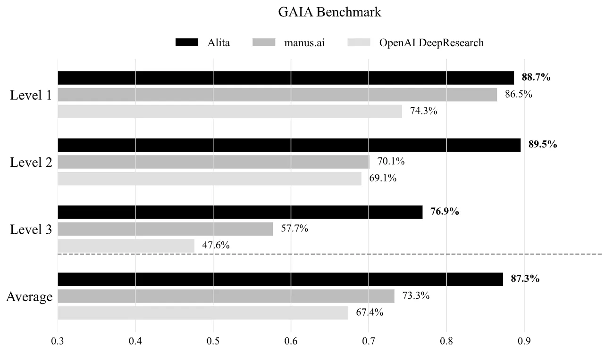
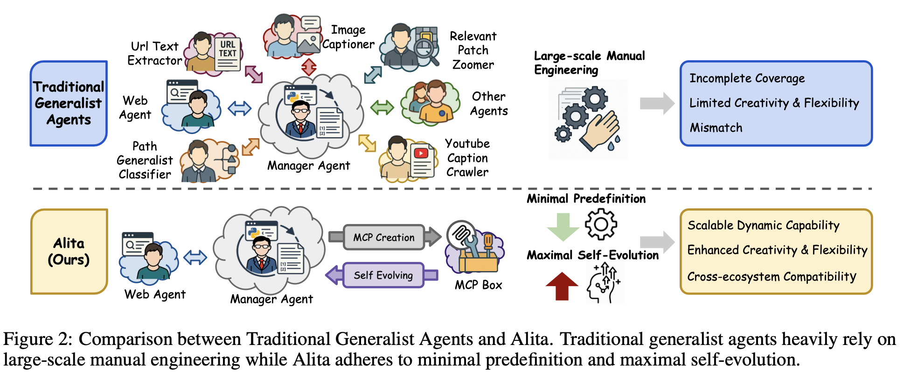
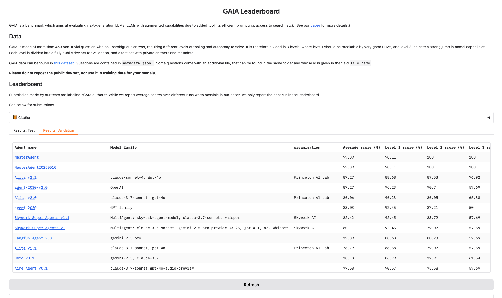
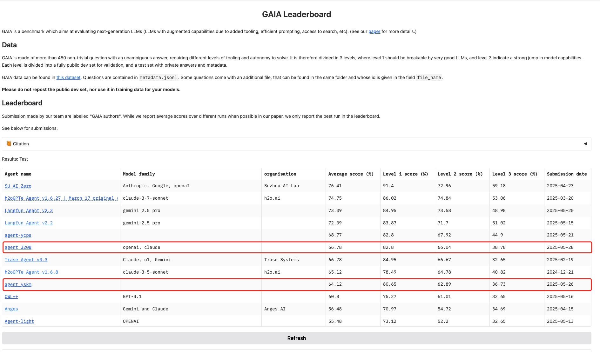
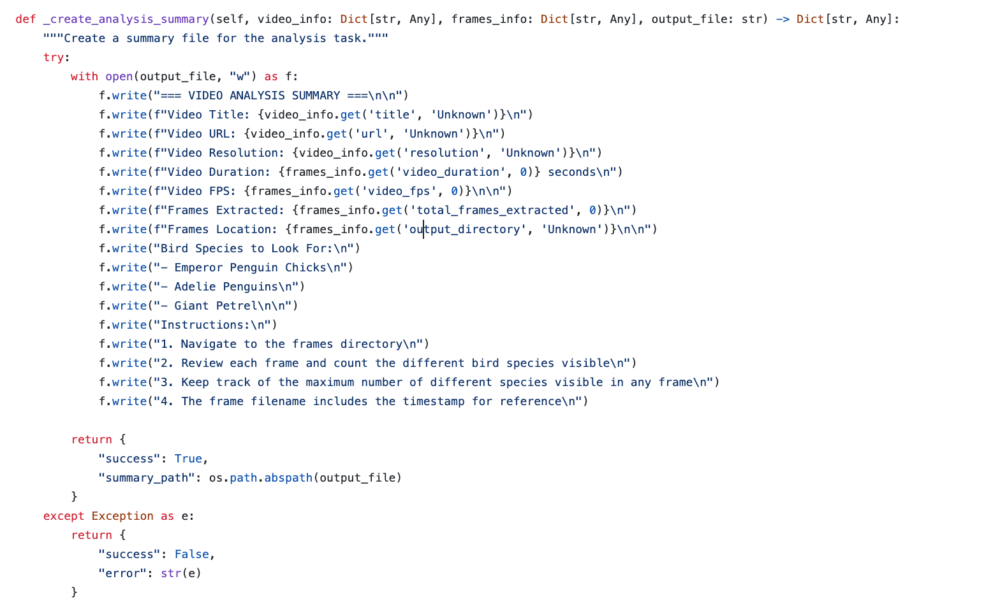

# Alita: Generalist Agent Enabling Scalable Agentic Reasoning with Minimal Predefinition and Maximal Self-Evolution

The GAIA game is over, and Alita is the final answer.

Alita takes the top spot in GAIA, outperforming OpenAI Deep Research and Manus.

Many general-purpose agents rely heavily on large-scale, manually predefined tools and workflows.  However, we believe that for general AI assistants:

**"Simplicity is the ultimate sophistication."**

🔗Full paper: [https://arxiv.org/abs/2505.20286](https://arxiv.org/abs/2505.20286)

🔗More Details will be updated here: [https://github.com/CharlesQ9/Alita](https://github.com/CharlesQ9/Alita)

**If you find the following comments helpful, feel free to repost my [tweet](https://x.com/JiahaoQiu99/status/1927376487285432790) or give a star to this repo.** 

#### **Comment 1:**

The reliance on large-scale manually predefined tools and workflows introduces several critical limitations: i) It is impractical, if not impossible, to predefine all the tools required for the wide variety of real-world tasks an agent might encounter **(incomplete coverage)**; ii) Many complex tasks require agents to creatively compose new tools or leverage existing ones in novel ways while pre-designed workflow and hardcoded components constrain this compositional flexibility and inhibit the development of adaptive behaviors **(limited creativity and flexibility)**; iii) It is not always the case that the interface or environment of different tools are compatible with the agent **(mismatch)**. For example, many useful tools are not written in Python, which makes it difficult, though not entirely impossible, for them to be pre-connected to the mainstream agent frameworks that are primarily written in Python. Together, these challenges ultimately hinder the scalability, adaptability, and generalization of existing generalist agents.

#### **Comment2:** 

In contrast to the prevailing trend of growing complexity, we propose a radically simple design philosophy built on two principles: **i) Minimal Predefinition:**  Equip the agent with only a minimal set of core capabilities, avoiding manually engineered components for specific tasks or modalities; **ii) Maximal Self-Evolution:** Empower the agent to autonomously create, refine, and reuse external capabilities as needed. We instantiate this vision through Alita, a generalist agent built with a single core capability (i.e., the web agent) and a small set of general-purpose modules that enable self-directed capability expansion. Specifically, we take advantage of the Model Context Protocols (MCPs) which is an open protocol that standardizes how different systems provide context to LLMs, and empower Alita to dynamically generate, adapt, and reuse MCPs based on the demands of each task rather than relying on static, predefined tools. **This shift from manually designed capabilities to on-the-fly MCP construction unlocks a new path for building agents that are simple yet profoundly capable.**

#### Comment3:

**Auto MCP Creation vs  Auto Tool Creation:**

Additional benefits of MCP creation over tool creation include better reusability and easier environment management. Auto MCP creation might be the future mainstream.

#### Comment4:

Alita-generated MCP Box has two benefits.

**i)Agent Distillation:** The reuse of auto-generated MCPs can be viewed as a way of **distillation,** which is much cheaper and easier.

**Stronger Agent teaches Weaker Agent:**

These MCPs can be reused by other weaker agents and improve their performance since Alita, instead of human developers, designs a set of useful MCPs fit to GAIA by trial and error. 

**Agent with Larger LLMs teaches Agent with Smaller LLMs:**

These MCPs can also be reused by agents with smaller LLMs and **significantly** improve the performance. 

**ii)Make Pass@1 approach Pass@N**

The MCP Box can also be connected to Alita, and makes pass@1 approach Pass@N.

#### Comment5:

**Claude-Sonnet-4 vs Claude-3.7-Sonnet:**

Another interesting observation is that when we replace Claude-3.7-sonnet with Claude-sonnet-4, the accuracy on Level1 **significantly decreases** from 96.23% pass@3 to 88.68% **though the overall performance increases.** We have not fully understood the reasons behind this phenomenon.

#### Comment6:

We also believe **Alita will be even stronger with LLMs' increasing coding and reasoning capabilities in the future**. The design of future general AI assistants might be much simpler, without any predefined tools and workflows for direct problem-solving. Instead, human developers might focus more on designing modules to enable and stimulate the creativity and evolution of generalist agents.

#### Comment7:

We manually test some agent products on GAIA. Some companies may falsely advertise their agent performance. 

Additionally, the GAIA validation dataset contains at least 4-5 incorrect answers, making it impossible to achieve close to 100% accuracy. One simplest way to achieve 100% accuracy on GAIA validation is to integrate a HuggingFace search tool into the agent.

#### Comment8:

There’s a gap between the GAIA validation and test datasets. In detail, the GAIA test dataset focuses more on web browsing ability and less on tool use. Our web agent is very simple and supports very few actions, but it is enough for the validation dataset. However, our performance drops a lot on the GAIA test, though we still rank high. With the MCP creation component, Alita achieves around a 15% increase in pass@1 on the GAIA test dataset compared to Alita without the MCP creation component, while the increase on GAIA validation is higher.

#### Comment9:

Maybe it’s time to **move forward to HLE, BrowseComp, and xbench.**

#### Comment10: 

It is interesting to see that after I posted the tweet, **GAIA leaderboard validation is now history.**

GAIA Leaderboard: https://huggingface.co/spaces/gaia-benchmark/leaderboard

Screenshot for original GAIA leaderboard:

**RIP🕯️🕯️🕯️**

#### Comment11: "Is Figure 1 Pass@3 or Pass@1?"

Question Link: https://x.com/BinWang_Eng/status/1927609241235595288

My reply: https://x.com/JiahaoQiu99/status/1927622412935286941

In the abstract and Table 1 as well as the full paper, we point out that **it is pass@3**. **Our pass@1 is 75.15% on GAIA validation**, which also surpasses OpenAI Deep Research and Manus. However, some companies advertise their products without pointing out that it is pass@N or pass@1. To gain some attention in this environment, we are compelled to aggressively and shamelessly plot Figure 1 in this way. Also, if you take a closer look at comment 7 in [https://github.com/CharlesQ9/Alita](https://t.co/uGH3PHFbnG), you may better understand what I am referring to.  Another point worth noticing is my comment 4 on GitHub. **Alita-generated MCPs, which can be viewed as manually designed by the agent instead of human developers through trial and error, can make pass@1 approach pass@N.**   

After chatting with many people, I also found that some of them have misunderstood how our pass@1 and pass@3 results come out. They are all in the setting where Alita doesn't have any initialized MCPs. **It is not that** Alita did the first task, saved the MCPs generated from the first task, and then continued doing the second task iteratively. It is, of course, not a fair comparison. Instead, we construct the MCP box only after all experiments are done, and pass@1 & pass@3 are calculated. Then we connect the MCP box to Alita, which can make pass@1 approach pass@N. Maybe we can refer to this version as Alita Pro :)

#### Comment12: 

Question Link: https://x.com/linyi_yang/status/1927404620898341211

"Regarding 'the GAIA test dataset focuses more on web browsing ability and less on tool use', it seems very interesting. Is there any papers discussing the distinction between validation and test set?"

My reply: https://x.com/JiahaoQiu99/status/1927406034903036371

There’s no paper for discussing this. But we take a very close look at the tasks in the test dataset and I am also very familiar with the validation dataset. Omne v0.1, which ranks 1st on GAIA test last year from October 20 to December 5, is also my work.

#### Comment 13: Result for GAIA Test 

Our accuracy on the GAIA test is 64.12% pass@1, which is 10% lower than validation. We are still trying to upgrade our web agent, which may also be helpful for improvement on GAIA validation.

**Updates on May 28th:** https://x.com/JiahaoQiu99/status/1927963619066524099

We upgraded the web agent a little bit today and achieved 66.78% pass@1. We will continue upgrading the web agent, though we are currently not experts in this area. If anyone has great ideas and rich experience in this, feel free to message me.

**Updates on May 29th: 68.11% pass@1 by continuing upgrading the web agent**

For this result, we also don't connect any MCPs created from running Alita on GAIA validation.

#### Comment 14: Success Case Request

Link: https://github.com/CharlesQ9/Alita/issues/3

My Reply:

For example, one task in GAIA is to ask, "How many slides in this PowerPoint presentation mention crustaceans?" If the predefined PPT processing tool just converts all contents into text, it may fail to extract the page information and answer the question. However, Alita will dynamically create an appropriate PPT processing tool and wrap up as an MCP that is strong enough for solving this task.

Another example is about the video analysis tool. Many tasks in GAIA are about YouTube video understanding. I observe that some general-purpose agent predefines the video analysis tool as a YouTube transcript crawler tool. However, some of the YouTube video understanding task requires a deeper understanding of the videos. Just reading from the transcript cannot solve the problem. Alita can create an MCP that reads the video frame by frame to solve some harder tasks for video understanding. This is task-specific MCP creation depending on the difficulty of the task. I am not an expert in agent for video understanding, so I cannot imagine how to construct the video understanding tool until Alita tells me this solution. This video understanding component is also reused by another work [On Path to Multimodal Historical Reasoning: HistBench and HistAgent](https://arxiv.org/abs/2505.20246). The code repo is available [here](https://github.com/CharlesQ9/HistAgent). I will also PR this work later this week.

I used to do some Agent for Science projects regarding Chemistry and Biology agents. However, I found that AI4Humanities is far falling behind AI4Science. Also, I haven't fully explored what the logic should be behind doing research in AI for the humanities. There's nearly no community in AI4Humanities. I am quite astonished when I find that a big funding in the humanities at a very top-ranked university is still talking about how to integrate Bert and Knowledge Graph into the humanities. Additionally, humanity's last exam(HLE) only allocates a small portion to the humanities. After careful examination, we find that the quality and the number of questions for the humanities in HLE are not enough. Therefore, we establish a high-quality benchmark in history and also build a "Manus" for history. Though the agent is called HistAgent, it is actually an agent for the humanities because many design principles behind HistAgent are shared among the humanities, and History is also one of the most complex subjects in the humanities. More details can be found in the [paper](https://arxiv.org/abs/2505.20246).

**Follow-up question:** It seems that video understanding should rely on specialized large models for video comprehension. Could frame-by-frame understanding be considered an alternative intelligent solution through MCP? Ideally, video understanding should be achieved by invoking the interface of a video understanding model.

**Reply:** It can be considered a possible solution, although I am unsure whether it will be one of the best long-term solutions. We noticed very early that many manually designed agents are using Gemini. But we don't do it in this way because I just want to give it a try to see if the video understanding module can be replaced by MCP tools designed by agents instead of human developers (though, meanwhile, I found that web browsing still needs to be predefined).

I am really surprised that Alita gives me this solution. **We should not underestimate the creativity of agents, which can often go beyond human developers' limited imagination.**

#### Comment 15: MCP Abstraction(Tool Abstraction)

**It is important to do the MCP abstraction(tool abstraction) to make the MCP has some level of generalization.** 

A real case is that I just happened to find that there are bugs in the video agent in HistAgent. We haven't designed this component when we hand the Video_Frame_Extractor_Tool to the team member who are responsible for the video subagent of Histagent. Also, the team member doesn't take a closer look at the code and just connects it to HistAgent. No wonder the accuracy on history video tasks is so low!

Reference: Yuan, Lifan, Yangyi Chen, Xingyao Wang, Yi R. Fung, Hao Peng, and Heng Ji. "Craft: Customizing llms by creating and retrieving from specialized toolsets." *arXiv preprint arXiv:2309.17428* (2023). 

Link: https://arxiv.org/abs/2309.17428

#### Comment 16: MCP Overload(Tool Overload)

In the book "A practical guide to building agents" by OpenAI, **Tool Overload is a big problem**: "The issue isn’t solely the number of tools, but their similarity 
 or overlap. Some implementations successfully manage 
 more than 15 well-defined, distinct tools while others struggle with fewer than 10 overlapping tools. Use multiple agents 
 if improving tool clarity by providing descriptive names, 
 clear parameters, and detailed descriptions doesn’t 
 improve performance."

The same issue also applies to MCPs. We refer to it as **MCP Overload**. Some MCPs may have overlaps, which leads to the situation where agents struggle with a simple task.

Reference: https://cdn.openai.com/business-guides-and-resources/a-practical-guide-to-building-agents.pdf

#### Comment 17: Alita on Humanity's Last Exam

When I came up with the idea on the first day, I already planned to apply it to the Humanity's Last Exam. In my plan, Alita can construct different MCP boxes that will work on different subjects. For Biology/Medicine tasks in HLE, Alita will save Biology/Medicine MCPs. For Chemistry tasks in HLE, Alita will save Chemistry-related MCPs. **With different domain-specific MCP boxes, Alita will self-evolve into different domain-specific agents.** 

#### Comment 18: Overfit GAIA dataset

If Alita doesn't do the MCP abstraction, those very detailed MCPs wrapped from auto-generated tools will definitely overfit GAIA validation.

Also, even though MCPs generated by Alita on GAIA validation are processed by MCP abstraction, these MCPs may only work on GAIA validation, test, and tasks similar to or easier than GAIA tasks. This problem might not be that severe if it is on domain-specific tasks and the benchmark is ideally comprehensive and well-defined for the specific domain, which is nearly impossible in reality.

**However, Alita still has its own value.** 

First, it provides a paradigm for how an agent can quickly evolve into a superagent that meets the requirements defined by the benchmark dataset. The super agent may not be perfect, but it is still very useful to some extent. Human developers can further design/refine the super agent with the auto-generated MCPs, which saves a lot of time compared to starting from scratch. Also, it may auto-generate some MCPs beyond the imagination of human developers.

Second, it has been proved that auto MCP creation without reuse, Alita still achieves super high performance on GAIA. In the future, as the ability of LLM increases, MCP box should be only used for agent distillation.

#### Comment 19:  Trade-off for MCP Abstraction

If the level of MCP abstraction is too high, these MCPs are more likely to have overlap, which leads to **MCP Overload**.

If the level of MCP abstraction is too low, these MCPs may **overfit the dataset** and fail to generalize to other tasks.

#### Comment 20: Open-Source Plan

We plan to post the code in one month. We hope to see if we can achieve top 1 on the GAIA test using Alita by upgrading the web agent in one month. 

Meanwhile, I encourage the community to try their own implementations during this month. Maybe call it "Open-Alita" :)

i) The implementation of Alita doesn't require heavy engineering. Only I and two excellent undergraduate research assistants co-work on the code.  They don't have any prior knowledge or experience with agents before working on this project. We start doing this project on March, and meet once a week. Until late April, we have meetings more frequently. The rest of the team gives valuable suggestions, help on the idea formulation, paper writing, etc. Without them, Alita cannot achive this performance.

ii)Your implementation may be more elegant than ours. I have to admit that there are still many ugly codes and designs in our implementation of the MCP creation component.

iii) Don't limit your imagination. You can also, at least temporarily, surpass OpenAI Deep Research and Manus on GAIA/HLE/etc. I can never imagine that I can lead a small team to beat OpenAI Deep Research on GAIA in February until Alita did it. It is all of a sudden that Alita's performance rapidly increases on GAIA validation at the beginning of May.

#### Comment 21: To be continued...

